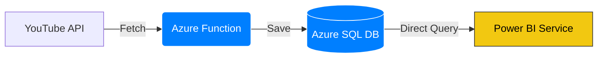
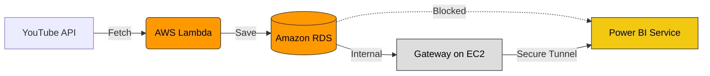
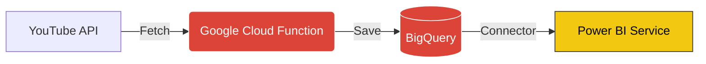

# Serverless Data Pipelines: Azure vs AWS vs GCP

Here is the exact **Data Pipeline Architecture** for each cloud provider using the "Serverless Code" (Python) style.

---

## 1. 🟦 Microsoft Azure (The "Golden Path") 🏆
**Why it wins:** Power BI is Microsoft. Azure is Microsoft. They talk without any extra software.

### The Pipeline Steps:
1.  **Trigger:** `Azure Function Timer` (Runs every 4 hours).
2.  **Compute:** `Azure Function (Python)` wakes up.
    *   Fetches data from YouTube API.
    *   Cleans data (Pandas).
3.  **Storage:** Saves data to `Azure SQL Database` (Serverless Tier).
4.  **Visualize:** `Power BI Service` connects **Directly** to Azure SQL.
    *   *Note:* No Gateway needed. Direct Cloud-to-Cloud refresh.

### 🖼️ Diagram

---

## 2. 🟧 AWS (Amazon Web Services)
**The Catch:** Power BI cannot talk directly to AWS databases securely without a bridge.

### The Pipeline Steps:
1.  **Trigger:** `Amazon EventBridge` (Timer).
2.  **Compute:** `AWS Lambda (Python)` wakes up.
    *   Fetches data from YouTube API.
3.  **Storage:** Saves data to `Amazon RDS (SQL Server/Postgres)`.
4.  **The Bridge:** You must install **On-premise Gateway** on a Window EC2 VM.
5.  **Visualize:** `Power BI Service` talks to Gateway -> Gateway talks to RDS.

### 🖼️ Diagram

---

## 3. 🟥 Google Cloud Platform (GCP)
**The Catch:** Similar to AWS, but Google BigQuery has a special connector that *sometimes* works directly, but often needs a Gateway for automated scheduled refresh depending on security policies.

### The Pipeline Steps:
1.  **Trigger:** `Cloud Scheduler` (Timer).
2.  **Compute:** `Google Cloud Functions (Python)` wakes up.
    *   Fetches data from YouTube API.
3.  **Storage:** Saves data to `BigQuery` (Data Warehouse).
4.  **Visualize:** `Power BI Service` uses "Google BigQuery Connector".
    *   *Note:* Often requires a Gateway if the database is behind a private VPC.

### 🖼️ Diagram

---

## � FAQ: "What IS a Gateway?"

### 🌉 Imagine a "Secure Bridge"
*   **Power BI** lives in the "Public Internet" (Microsoft Cloud).
*   **Your Database** (AWS RDS / Laptop) lives in a "Private House" (Private Network) with the door locked and firewall up.

Power BI **cannot** walk into your private house to read data. The door is locked.

### The "Gateway" Software
To solve this, you install **Gateway Software** on a computer inside the house.
*   **Without Gateway:** Power BI knocks -> Door Locked � -> Refresh Failed.
*   **With Gateway:** Power BI knocks -> Gateway (inside) hears it -> Gateway grabs data -> Gateway hands it out the window to Power BI ✅.

### � Why Azure DOESN'T need it
*   **Same Family:** Azure SQL and Power BI live in the **same ecosystem** (Microsoft Cloud).
*   **The Checkbox:** Azure SQL has a simple checkbox: `Allow Azure Services to access this server`.
*   **Result:** This instantly "unlocks the door" for Power BI. No extra "Bridge Software" (Gateway) is required because they are neighbors in the same cloud.
